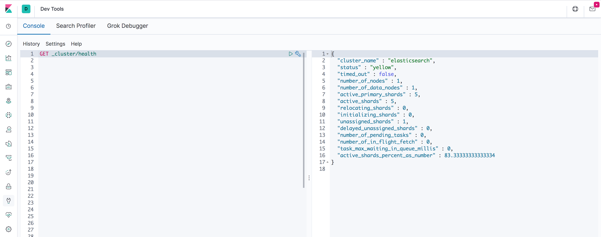
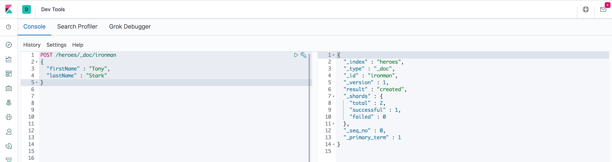

## Concepts essentiels

Voici les concepts essentiels de ElasticSearch :

### Document
Un document est un élément unitaire, au format JSON, stocké dans ElasticSearch.

### Noeud
Un noeud est une instance d'ElasticSearch, un noeud appartient à un **cluster**.

### Cluster
Un cluster est composé d'un ou plusieurs **noeuds** ElasticSearch qui sont connectés entre eux et qui partagent le même nom. Un cluster comporte un noeud maître unique (**master node**). En cas de défaillance du master node, un nouveau master node est élu parmi les noeuds restants.

### Index
Un index est un regroupement logique d'un ensemble de documents. Un index est composé de **shards**. Tous les documents appartienent à un index.

### Type
Un type est un sous-ensemble d'un index qui permet de regrouper des documents. De la même manière que pour les index, les types permettent de configurer le stockage des documents. Tout document appartient à un type.

:warning: Les types sont dépréciés depuis la version 6.x. Auparavant il était possible d'avoir plusieurs types au sein d'un même index. Pour les index créés depuis la version 6, seul un type est autorisé par index. Si possible préférez `_doc` comme nom de type pour que les URLs soient compatibles avec la future version 7.x (cf. [explication](https://www.elastic.co/guide/en/elasticsearch/reference/current/removal-of-types.html))

### Shard
Un shard est un fragment d'un index. Ce sont les shards qui permettent de partitionner les index sur plusieurs noeuds. Ainsi, un index peut être partitionné sur autant de noeuds que cet index comporte de shards. Le nombre de shards par défaut est de **5**.

### Réplique
Une réplique est une copie intégrale des données d'un index. Les répliques permettent d'améliorer la tolérance à la panne du cluster ainsi que la durabilité des données. Une réplique comporte autant de shards que l'index original. Le nombre de répliques par défaut est de **1**.

## Prise en main de l'API

ElasticSearch expose l'ensemble de ses APIs à l'aide d'une API [REST](http://www.pompage.net/traduction/comment-j-ai-explique-rest-a-ma-femme), il est donc possible d'utiliser n'importe quel client HTTP pour manipuler ElasticSearch.

Les DevTools de **Kibana** facilitent l'utilisation d'ElasticSearch.



Votre client *REST* préféré, si vous en avez un, fera sans problèmes l'affaire :smile:.

### Les conventions

L'API d'ElasticSearch est composé d'un ensemble d'APIs qui exposent des opérations spécialisées. Cette API est conforme aux standards REST. Elle est orientée ressources, s'appuie sur les verbes HTTP, les codes de retours HTTP...

D'une manière générale, les endpoints sont construits de la manière suivante :

```
http://[host]:[port]/index/type/_action|id
```

Par exemple

* pour effectuer une recherche parmi les documents de type 'person' dans l'index 'heroes' :
```
http://localhost:9200/heroes/person/_search
```
* pour compter le nombre de documents de type 'person' dans l'index 'heroes'
```
http://localhost:9200/heroes/person/_count
```
* pour accéder au document 'ironman'
```
http://localhost:9200/heroes/person/ironman
```

Les actions sur les index permettent généralement d'effectuer l'opération sur plusieurs index simultanément. Par exemple, pour effectuer une requête sur les index `index1` et `index2`, il est possible d'utiliser l'URL suivante :

```
http://localhost:9200/heroes,vilains/_search
```

Vous trouverez de nombreux exemples (inclusions, exclusions, jokers, ...) dans la documentation.

## CRUD

### Insertion

Pour insérer un document, on utilise la requête suivante :

```bash
curl -XPOST 'http://localhost:9200/heroes/person/ironman' -H 'Content-Type: application/json' -d '{
	"firstName" : "Tony",
	"lastName" : "Stark"
}'
```

ou à l'aide de Kibana :



Le verbe, **POST**, indique qu'on insère un document.

L'URL est construite de la manière suivante :

```
http://<host>:<port>/<index>/<type>/<id>
```

Si l'index n'existe pas au moment de la création du document, celui-ci est créé automatiquement.

### PUT vs POST

Pour l'insertion de données, les verbes **POST** et **PUT** sont équivalents. Le verbe **POST** permet d'insérer des documents sans spéficier l'identifiant du document.

```bash
curl -XPOST 'http://localhost:9200/heroes/person/' -H 'Content-Type: application/json' -d '{
	"firstName" : "Charles",
	"lastName" : "Xavier"
}'
```

La réponse renvoyée contient l'identifiant généré par ElasticSearch.

```json
    {
      "_index": "heroes",
      "_type": "person",
      "_id": "AVLAbGUTL1N-EpXDlqsB",
      "_version": 1,
      "_shards": {
        "total": 2,
        "successful": 1,
        "failed": 0
      },
      "created": true
    }
```

### Extraction

Pour extraire un document à l'aide de son identifiant, on utilise la requête suivante.

```bash
curl -XGET 'http://localhost:9200/heroes/person/ironman'
```

La réponse renvoyée est la suivante :

```javascript
	{
	   "_index": "heroes",
	   "_type": "person",
	   "_id": "ironman",
	   "_version": 1,
	   "found": true,
	   "_source": {
	      "firstName": "Tony",
	      "lastName": "Stark"
	   }
	}
```

L'attribut `found` indique que le document a bien été trouvé (`true` dans notre cas, `false` si le document n'a pas été trouvé). L'attribut `_source` contient le document extrait.

### Mise à jour

Pour mettre à jour les données, il est possible d'utiliser les requêtes **PUT** et **POST** présentées ci-dessus. Cette méthode permet de mettre à jour l'ensemble du document.

Il est possible d'effectuer des mises à jour partielles en utilisant l'API `_update`.

```bash
curl -XPOST 'http://localhost:9200/heroes/person/ironman/_update' -H 'Content-Type: application/json' -d '{
	"doc" : {
		"firstName" : "Tomy"
	}
}'
```

### Suppression

Pour supprimer un document, on utilise le verbe **DELETE**

```bash
curl -XDELETE 'http://localhost:9200/heroes/person/ironman'
```

### Exists

Il est possible, à l'aide du verbe **HEAD** de vérifier l'existence d'un document (**attention, cette requête ne fonctionne pas sous Kibana !**)

```bash
curl --head 'http://localhost:9200/heroes/person/ironman'
```

Les statuts renvoyés :

* **200** indique que le document existe
* **404** indique que le document n'existe pas

## Next

Vous pouvez passer à l'étape suivante : [L'API de recherche](./step-2.md)
